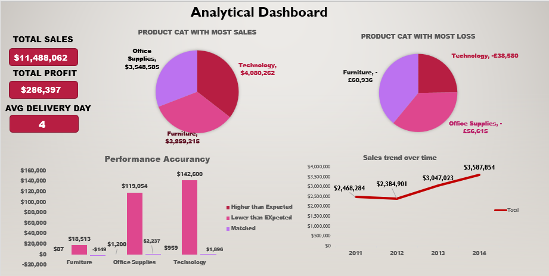
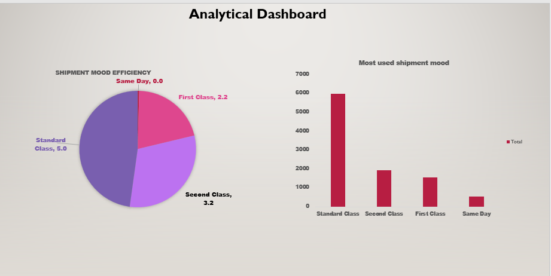
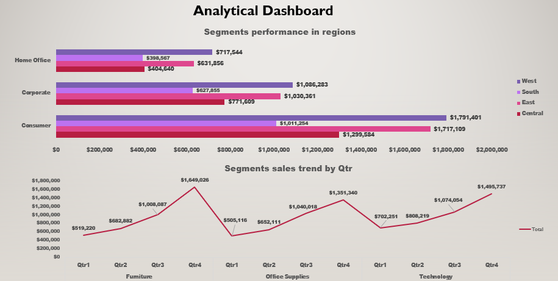

🛒 Superstore Sales Analysis

📌 Overview

Analyzed Superstore sales data to evaluate product performance, customer behavior, and sales trends, with the goal of improving business decisions.

🛠 
Tools
Excel, Power Query

📊 Dashboard Preview
This project featured a 3-page interactive dashboard:

**Page 1: PRODUCT PERFORMANCE OVERVIEW**

-Total aales/ Total profit / Avg delivery day
-Product Category with most sales
-Performance accurracy 
-Product category with most loss
-Sales trend over time

 **Page 2: SHIPMENT MOOD EFFICIENCY**

 

 -Shipment mood efficiency
 -Most used shipment mood

**Page 3: SEGMEMTS PERFORMANCE**

 

 -Segments performance in regions 
 -Segments sales trend by Qtr

📊 Key Insights
	•	Technology category generated the highest sales but underperformed in profit
	•	Overall profits were lower than expected across categories
	•	Sales show strong growth over time, peaking in Q4 and dipping in Q1
	•	Standard shipping is most used, while same-day delivery is fastest
	•	Consumer segment leads sales; Home Office underperforms

💡 Recommendations
	•	Optimize pricing and discount strategies
	•	Improve cost efficiency to boost profitability
	•	Increase marketing for underperforming segments
	•	Focus on Q4 as the key revenue period

📂 Files
	•	Presentation.pdf– Full analysis 
